# Task 8 - Decrypt the Comms - (Reverse Engineering, Cryptography)
**NOTE: solution files for this task will mostly be in the "dockerdir" directory**

Prompt
```
The security team at Blue Horizon Mobile was able to capture a packet destined to the device under investigation. It looks to be encrypted, and a quick analysis of the firmware show it uses an HMAC scheme for authentication.

Can you decrypt the packet and recover the secret HMAC key the software uses to verify the contents?


Downloads:

Packet capture (capture.pcap)
Enter the HMAC key string used to authenticate the given packet.
```

I was provided with a single UDP packet in a pcap file.

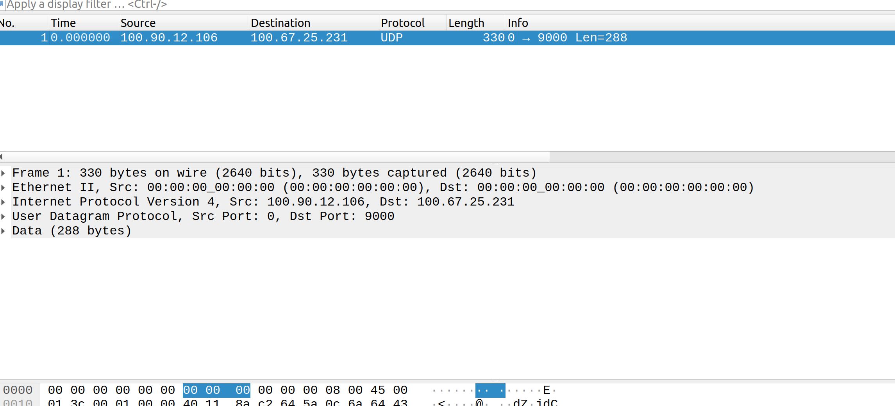

The packet is a UDP packet destined for port `9000` using an unrecognized protocol.


## Raw data from the UDP packet:
```
00000000: 6b17 d1f2 e12c 4247 f8bc e6e5 63a4 40f2  k....,BG....c.@.
00000010: 7703 7d81 2deb 33a0 f4a1 3945 d898 c296  w.}.-.3...9E....
00000020: 4fe3 42e2 fe1a 7f9b 8ee7 eb4a 7c0f 9e16  O.B........J|...
00000030: 2bce 3357 6b31 5ece cbb6 4068 37bf 51f5  +.3Wk1^...@h7.Q.
00000040: 9aaa 943b 66fa ed7e af57 c1cf 35e3 c88f  ...;f..~.W..5...
00000050: e7ef 2080 0985 0798 ae0c a530 502c f43f  .. ........0P,.?
00000060: ba46 1296 20f9 1e37 42af e650 cee2 7b8d  .F.. ..7B..P..{.
00000070: 9e81 804f 081e 254d 686e 9577 72d2 3e23  ...O..%Mhn.wr.>#
00000080: 6cb1 00e3 f74e 6cf5 76f0 5d4d 4a58 3e50  l....Nl.v.]MJX>P
00000090: ef6e 8b00 c450 5e93 baaf 92d2 1a00 9b6d  .n...P^........m
000000a0: 711f 70a3 bfb6 18fe 71bc 1729 e04b 318d  q.p.....q..).K1.
000000b0: f7f2 1875 e437 eebe 5b58 5643 88bf 444d  ...u.7..[XVC..DM
000000c0: 2769 3f48 fba7 8e3a 2866 d902 4c83 1203  'i?H...:(f..L...
000000d0: a59c f8b5 db71 7f03 881c 9ea2 22bc e178  .....q......"..x
000000e0: fa5c f9ca 0bbc 1b2a 0caf 67ea ac95 38be  .\.....*..g...8.
000000f0: b233 9658 f86f 6504 a0a5 cd3c 672d 2398  .3.X.oe....<g-#.
00000100: f16f 6e7d f867 51e1 c008 d792 c068 9dae  .on}.gQ......h..
00000110: 7db1 cc16 9179 1a4a a471 c1b6 288a ef09  }....y.J.q..(...
```

## Identifying the structure of the packet.
A decent amount of of reverse engineering of `agent` went into determining the structure of the packet.
```bash
╰─$ binwalk agent

DECIMAL       HEXADECIMAL     DESCRIPTION
--------------------------------------------------------------------------------
0             0x0             ELF, 64-bit LSB executable, version 1 (SYSV)
61221         0xEF25          Certificate in DER format (x509 v3), header length: 4, sequence length: 6689
658416        0xA0BF0         AES S-Box                              <--------------
658744        0xA0D38         SHA256 hash constants, little endian   <-------------
659512        0xA1038         Unix path: /usr/share/locale
684840        0xA7328         Unix path: /usr/share/zoneinfo
691528        0xA8D48         Unix path: /var/run/nscd/socket
693968        0xA96D0         Unix path: /usr/lib/aarch64-linux-gnu/
694048        0xA9720         ELF, 64-bit LSB core file no machine, (SYSV)
699968        0xAAE40         Unix path: /usr/lib/locale
701824        0xAB580         Unix path: /usr/lib/locale/locale-archive
```

`binwalk` helped me to identify that `agent` contains constants for both `AES` and `SHA256`, so I looked at where those were used to confirm that the locations where those constants were used in `agent` was associated with the code in `cmd_thread`.

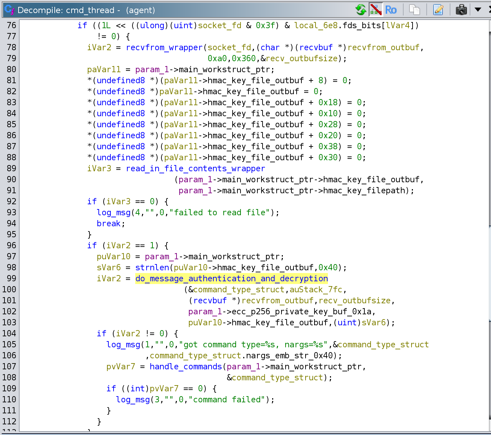

A quick look at the locations of those constants confirmed that they were used in the function that I assumed was meant for message authentication and decryption, which I named `do_message_authentication_and_decryption`.

## Reviewing the problem statement to create a roadmap for the task
The problem statement for this task was "Can you decrypt the packet and recover the secret HMAC key the software uses to verify the contents?". As a reminder, the firmware image had a few files that were missing, empty, or filled with junk data: `ecc_p256_private.bin`, `hmac_key`.

In general I don't know very much about cryptography. I know the basics, but not much about the actual implementations or specifics of any algorithms. What I do know is that `AES` is generally understood to be a mathematically sound algorithm that is resistant to brute force attacks like the one I utilized in task 4. This indicated to me that to decrypt something encrypted with `AES` without knowing the encryption key likely means finding some sort of flaw in the implementation of the algorithm or in how the algorithm is used in the context of an application or binary.

To help narrow down where to look in `agent` for that kind of flaw, I decided to prioritize determining if the implementations of `AES` and `SHA256` were from a common open-source library; If the implementations were open-source, it would make more sense to me to focus on how the algorithms were used rather than the specifics of what was done in the implementations.


### Subtasks for this task
- Identify the structure of the packet
- Identify all of the algorithms utilized for cryptography, hashing, and authentication in `agent` used for handling incoming command packets
- Identify which, if any, of the cryptography algorithm implementations in `agent` are open-source
- Uncover and document the stages and different forms of the "life" of the packet from when it is received all the way to where the commands encrypted in the packet are executed


# Reversing the decryption and authentication functionality
As shown above in the `binwalk` output, I was able to find some crypto constants used for `AES` and `SHA256` pretty quickly, so I started with those global variables and work my way from the functions that accessed them back to `do_message_authentication_and_decryption`. It helped a ton to just have those functions associated with their algorithms. For these two algorithms I went on github to find implementations to compare against the functions from `agent`. While none were an exact match, some of them had similar enough functionality to get a general idea of which functions were roughly equivalent.

I also noticed a function accessing a different global, which turned out to be a constant for `NIST-P256` elliptic curve cryptography. I wasn't very familiar with `ECC` before this so I spent some time learning about how it is used and I learned that it is used for modern  [key-exchange](https://en.wikipedia.org/wiki/Key_exchange) algorithms. The fact that a key-exchange algorithm would be used in something using `udp` also stuck out to me as a potential issue, as `udp` is `connectionless`. It also seemed extremely wrong to have something related to a key exchange in the same packet as an encrypted message (which presumably used that key).

I tried to match up some of the functions between the implementation of `p256` in `agent` and implementations that I found on github, but they were all different enough that I couldn't really identify any specific functions, so I decided to come back to that part later and work on mapping out a general flow for packet decryption first.


## Mapping out the decryption flow through dynamic analysis
I initially tried to statically compile [frida](https://github.com/frida/frida) for `aarch64`, but the project doesn't officially support that quite yet and when I tried to hack it in I ran into a lot of issues and eventually gave up.
Instead, I used the `gdbserver` that I compiled for `aarch64` earlier. `gdb` allows you to specify an `init` file that will execute when you run `gdb` with `gdb -x initfile`. Somewhat recently I learned that you can have `gdb` execute certain commands when it reaches breakpoints with something that looks like this:
```
# base address of the binary
set $BINBASE = 0x0

# create a convenience variable containing the address of the function `sha256_ctx_init`
set $BP_sha256_ctx_init = $BINBASE + 0x0040b790

# create a new breakpoint at the address of `sha256_ctx_init`
b *$BP_sha256_ctx_init
# upon reaching the breakpoint, execute the following commands
commands
    # reduce verbosity (don't print out the commands as they execute)
    silent
    # print the name of the function and the contents of the register x0
    printf "SHA256_ctx_Init %p\n", $x0
    # continue execution
    continue
# stop executing commands after the breakpoint
end
```

This stub pretty much just prints out values when code reaches the breakpoint and continues execution. It isn't exactly fast, but it does work. I made a bunch of breakpoints like this at the start of functions and at the locations where the functions returned to print out information like the register values that were passed in to functions as parameters, the contents of buffers if those values were pointers, and the return values after functions returned. I also ended up writing a very small `python` script to interact with the `gdb` api so that I could get a more readable hexdump. If you are interested in seeing the gdbinit file that I used, it is [here](../dockerdir/gdbinit_agent).

To actually run the server, I ran this command on the qemu guest:
```
./gdbserver-aarch64 :1234 /agent/agent /agent/config
```

and I ran this command on the docker container (after installing `gdb-multiarch`):
```
gdb-multiarch -x gdbinit_agent
```

Then to send the packet through to udp port 9000, I ran this command in a different terminal on the docker container:
```
cat packet_data.bin | nc -u 10.101.255.254 9000
```

Then I followed the data in gdb and ghidra.

# Decryption Flow
```
ecc priv key (first 0x20 bytes is used as point coordinates )
|
V
ecc decrypt on 0x20 bytes of the packet at offset 0x20
|
V
sha256 0x20 bytes
|
V
hash is split up and used to seed AES decryption of packet +0x60 bytes
          (only 3/4ths of the hash are actually used, not sure but this might be a weakness)
          (will refer to it as the ECC hash)


AES block-based decryption


ECC HASH (first 16 bytes)
|
|
V
Key Expansion using sbox
            | (expanded key)
            |
            |
            V
/--->-->AES Cipher (unknown mode)  <---- ECC hash bytes[32:48] + round number as IV
|       |
|       |
^       V
|       16 byte Block Key
|       |
|       |
^       V
|       xord with cipher text to decrypt plaintext
|       |
|       |
^       |
|       V
\---<---repeat previous steps after key expansion until all data has been decoded
            |
            |
            V
            AES decrypted command_type_struct (same length as payload bytes)


HMAC key
|
V
SHA256 (if hmac strlen > 0x40)
|
V
xor with b'\\' or b'6'
|
V
xord_hmac_buf A and B


xord_hmac_buf A (0x36)
|
V
sha256  <--- command_type_struct (all of)
|
V
sha256  <--- xord_hmac_buf B (0x5c)
|
V
compared with hmac at 0x40 in packet
```

**NOTE: This diagram may be replaced with a slightly more sane one in the near future**


# Packet structure
After looking at the command handler functions it is pretty clear that this is the structure of the command payload:
```c
// size 0x60
struct CommandHeader {
    byte ecc_encrypted_seed[0x40];
    byte hmac[0x20];
    byte payload[0];
}


// size 0x80+,
struct CommandPayload {
    char command_type_str[0x40];  // this can only actually be the string representation of an integer from 0-7
    char nargs_str[0x40];         // string representing a number of arguments from 0-10
    char args[strtol(nargs_str, 0, 10)][0x40];           // Variable size
}

```


## Breakdown of data from the UDP packet:

```
NIST-P256 Elliptic Curve Cryptography data:
    - 0x40 (64) bytes

00000000: 6b17 d1f2 e12c 4247 f8bc e6e5 63a4 40f2  k....,BG....c.@.
00000010: 7703 7d81 2deb 33a0 f4a1 3945 d898 c296  w.}.-.3...9E....
00000020: 4fe3 42e2 fe1a 7f9b 8ee7 eb4a 7c0f 9e16  O.B........J|...
00000030: 2bce 3357 6b31 5ece cbb6 4068 37bf 51f5  +.3Wk1^...@h7.Q.

HMAC hash
    - (sha256sum of a manipulated unknown hmac key and the plaintext for the AES encrypted buffer)
    - 0x20 (32) bytes

00000040: 9aaa 943b 66fa ed7e af57 c1cf 35e3 c88f  ...;f..~.W..5...
00000050: e7ef 2080 0985 0798 ae0c a530 502c f43f  .. ........0P,.?

AES Encrypted buffer
    - (key is determined based on the ECC data in the packet)
    - 0xc0 (192) bytes

00000060: ba46 1296 20f9 1e37 42af e650 cee2 7b8d  .F.. ..7B..P..{.
00000070: 9e81 804f 081e 254d 686e 9577 72d2 3e23  ...O..%Mhn.wr.>#
00000080: 6cb1 00e3 f74e 6cf5 76f0 5d4d 4a58 3e50  l....Nl.v.]MJX>P
00000090: ef6e 8b00 c450 5e93 baaf 92d2 1a00 9b6d  .n...P^........m
000000a0: 711f 70a3 bfb6 18fe 71bc 1729 e04b 318d  q.p.....q..).K1.
000000b0: f7f2 1875 e437 eebe 5b58 5643 88bf 444d  ...u.7..[XVC..DM
000000c0: 2769 3f48 fba7 8e3a 2866 d902 4c83 1203  'i?H...:(f..L...
000000d0: a59c f8b5 db71 7f03 881c 9ea2 22bc e178  .....q......"..x
000000e0: fa5c f9ca 0bbc 1b2a 0caf 67ea ac95 38be  .\.....*..g...8.
000000f0: b233 9658 f86f 6504 a0a5 cd3c 672d 2398  .3.X.oe....<g-#.
00000100: f16f 6e7d f867 51e1 c008 d792 c068 9dae  .on}.gQ......h..
00000110: 7db1 cc16 9179 1a4a a471 c1b6 288a ef09  }....y.J.q..(...
```


`ecc_p256_public.bin`
```
00000000: 894d 6341 662a 70e3 d4f8 467c 9b25 7bbc  .McAf*p...F|.%{.
00000010: 0ff2 f558 a241 6335 c7d4 8845 532c 8ca6  ...X.Ac5...ES,..
00000020: e172 6175 fb50 ef22 8aa6 55a2 3793 4b8b  .rau.P."..U.7.K.
00000030: 2969 912d 7f29 118d 8b64 bf2d 73f8 d5b8  )i.-.)...d.-s...
```


# Implications of packet structure and decryption flow

This flow means that the hmac key is technically guessable without having the ecc p256 private key so long as you know the contents of the aes encrypted buffer ahead of time. Because the serialization of the arguments for each command is a series of `char[0x40]` buffers and the inputs are strings or have a fairly clear de-serialization process, a pretty good guess at the contents of any given payload can be made solely based on the size of the encrypted packet. It is also dependent on the HMAC hash not being encrypted, which it isn't in this case.

# Identifying Command packets before decryption

## A brief review of the commands, with a little bit more information

```
// size 0x80+,
struct CommandPayload {
    char command_type_str[0x40];  // this can only actually be the string
                                  // representation of an integer from 0-7
    char nargs_str[0x40];         // string representing a number of
                                  // arguments from 0-10
    char args[strtol(nargs_str, 0, 10)][0x40];    // Variable size
}
```

There was one check before the `switch` statement that validated the command used and the number of arguments for the commands
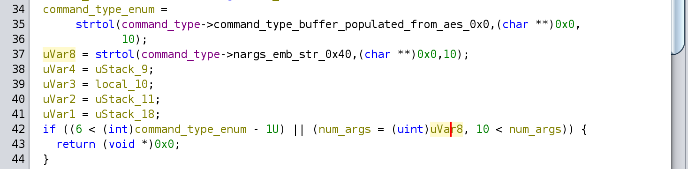

- each arg is a char[0x40] buffer,
- max of 10 args

### 0: stop waiting for other threads and remove restart file
- 0 args with arg check
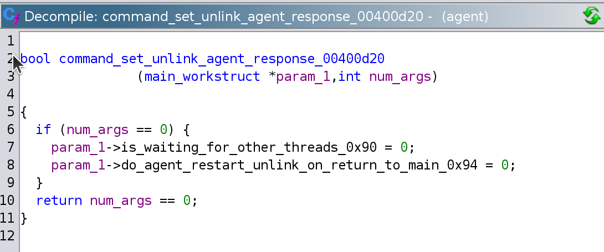

And the `unlink` happens back in main:
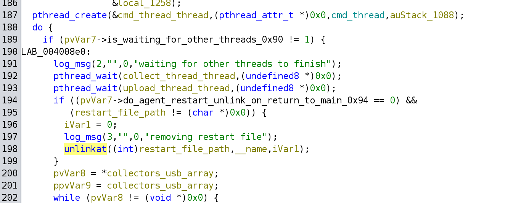

### 1: Run diagclient
- 4 args without args check
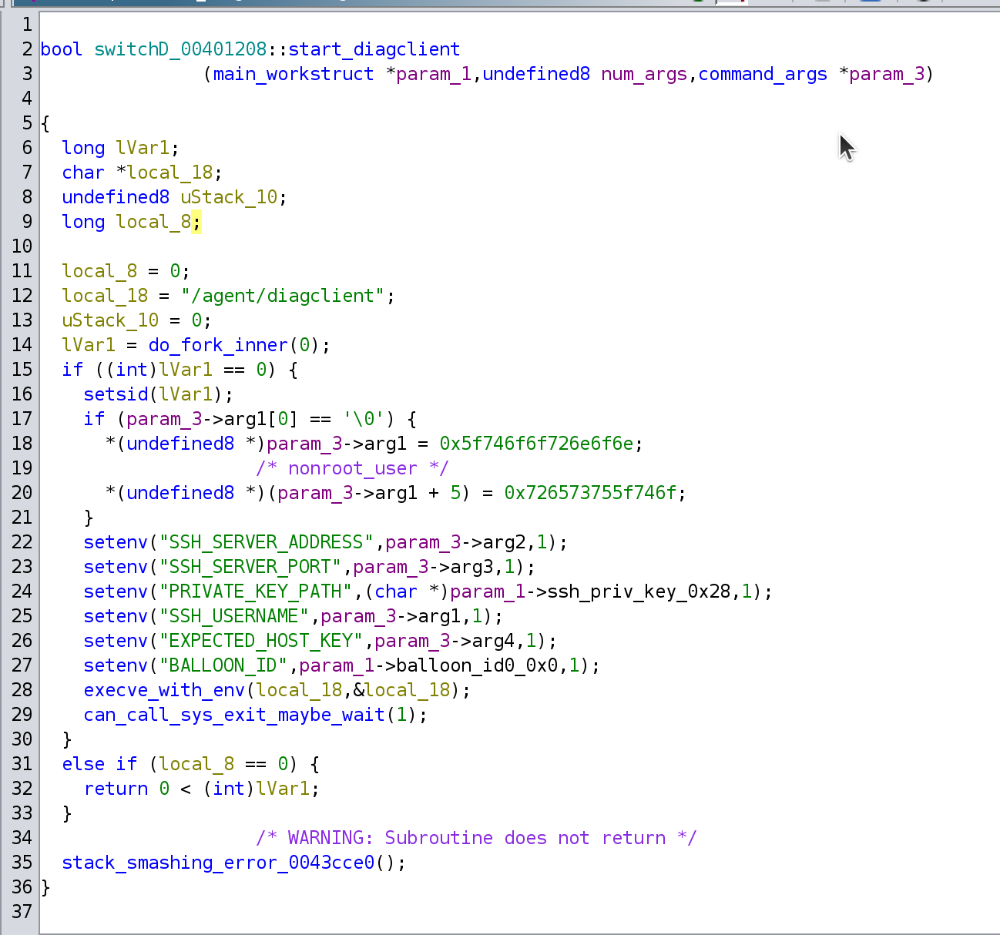

### 2 update hmac
- 1 arg with arg check
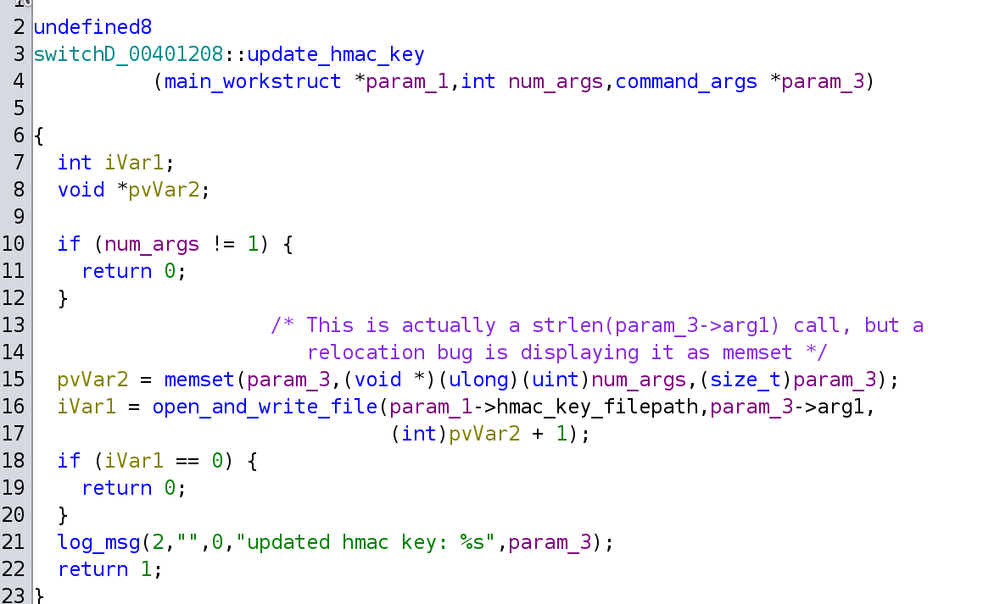

### 3 set collect enabled
- 2 args with arg check
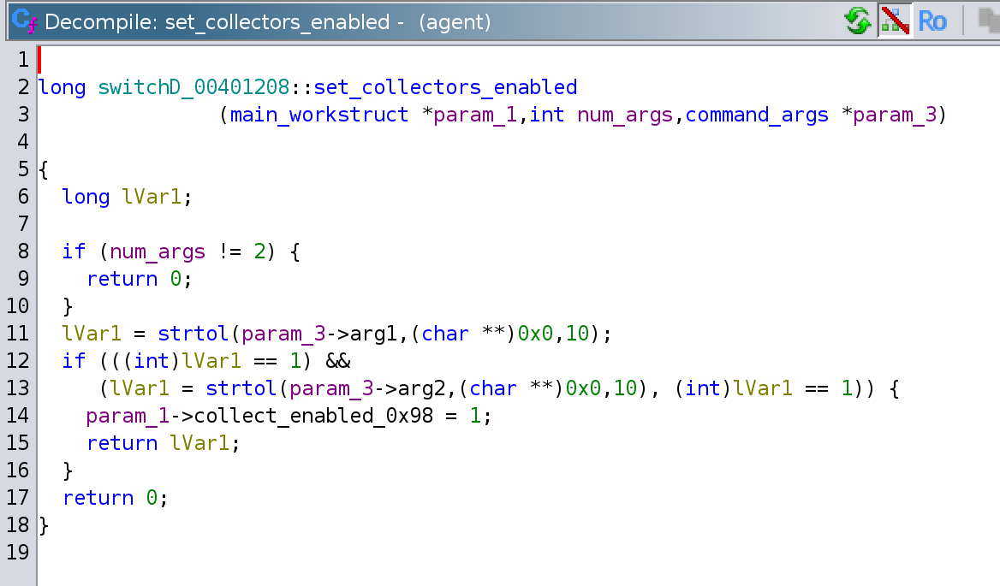

### 4 set collect disabled
- 2 args with arg check

### 5 send message to navigation
- 3 args with arg check
- args are (ip, port, "alt")
- unsure what alt is
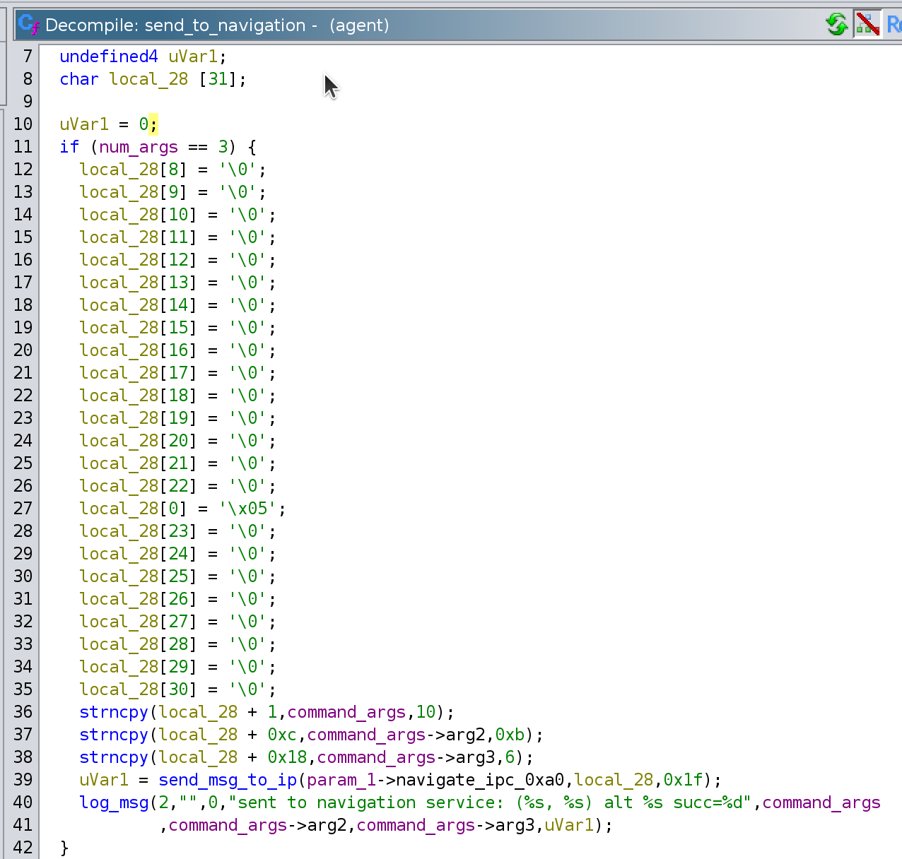

### 6 stop waiting for other threads
- no args no arg check
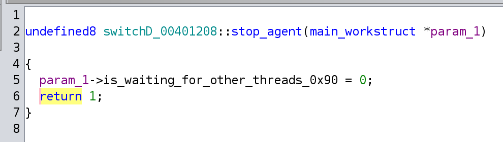

### 7 change collectors
- 3 args with arg check
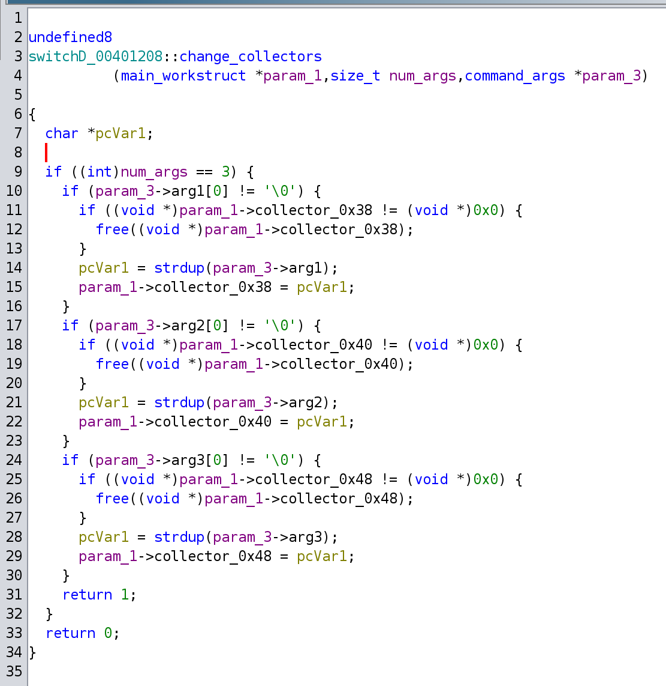

## Actual Packet
Revisiting the command payload structure from before:
```
// size 0x80+,
struct CommandPayload {
    char command_type_str[0x40];  // this can only actually be the string
                                  // representation of an integer from 0-7
    char nargs_str[0x40];         // string representing a number of
                                  // arguments from 0-10
    char args[strtol(nargs_str, 0, 10)][0x40];    // Variable size
}
```

Because the packet provided only has `0xc0` bytes for its command payload and the minimum size for a command would be `0x80`, the only commands that could be valid would be `2` and `6`. Command `2` is the closest match because the number of arguments is necessary for that command is `1`, and the size of the command payload header (0x80 bytes) and one argument adds up to `0xc0` bytes. Command `2` is also the only command that takes `1` argument, making this the only reasonable choice. Command `6` would technically be valid because there is no check for the number of arguments for command `6`, however if this was in the packet it would also mean that there is 0x40 bytes of extra useless data, which seems unlikely.

So the actual decrypted contents of the command payload would looks something very similar to this (except with a real new `HMAC` key)
```
command_bytes = b''.join([b'2'.ljust(0x40, b'\x00'),
                          b'1'.ljust(0x40, b'\x00'),
                          b'NEW-HMAC-KEY'.ljust(0x40, b'\x00')])
```

```
Command Type (UPDATE_HMAC)
00000000: 3200 0000 0000 0000 0000 0000 0000 0000  2...............
00000010: 0000 0000 0000 0000 0000 0000 0000 0000  ................
00000020: 0000 0000 0000 0000 0000 0000 0000 0000  ................
00000030: 0000 0000 0000 0000 0000 0000 0000 0000  ................

Number of Arguments
00000040: 3100 0000 0000 0000 0000 0000 0000 0000  1...............
00000050: 0000 0000 0000 0000 0000 0000 0000 0000  ................
00000060: 0000 0000 0000 0000 0000 0000 0000 0000  ................
00000070: 0000 0000 0000 0000 0000 0000 0000 0000  ................

New HMAC Key
00000080: 4e45 572d 484d 4143 2d4b 4559 0000 0000  NEW-HMAC-KEY....
00000090: 0000 0000 0000 0000 0000 0000 0000 0000  ................
000000a0: 0000 0000 0000 0000 0000 0000 0000 0000  ................
000000b0: 0000 0000 0000 0000 0000 0000 0000 0000  ................
```

Due to the command being an `Update HMAC Key` command, the last argument couldn't be known ahead of time without brute forcing. Because the hmac key could be anywhere from 1 to 64 bytes in an unknown format, my strategy of guessing the HMAC key without decrypting the packet would probably take longer than the rest of my life (and therefore longer than the codebreaker challenge was running), so I was forced to actually figure out how to decrypt the packet.

# Identifying the AES Mode:

After looking online at a [basic aes implementation](https://github.com/kokke/tiny-AES-c), it looked like the expanded key size for aes 128 is 176 bytes and the key length is 16 bytes, which matched what I saw in `agent`.

## attributes of the aes impl
- block cipher
    - loops over the function that does decryption and decrypts 0x10 bytes at a time
- 0x10 byte blocks
- is AES 128
- 176 byte expanded key
- 10 rounds per block
- 16 byte key
    - key is the first 16 bytes of the sha256sum of the ecc-encrypted stuff once it is decrypted
- Uses a 16 byte IV
    - first 8 bytes are a portion of the sha256sum of the ecc-encrypted stuff once it is decrypted
    - second 8 bytes can always be known and are just the little-endian index (starting at 1) of the round
- only an SBox was found, not an inverse sbox, which I beleive indicates that the mode uses the same function for encryption as decryption

## Valid-ish AES modes
- OFB - matched initially on a live test, current best candidate, but `pycryptodome` doesn't match after the first run, so a whole new instance needs to be created with the updated IV every time
- CTR - uses outer loop, and increments a value in its IV every time, could very easily be this. Confirmed, This works, it just needs very specific arguments in `pycryptodome`

**AES is 128 bit in CTR mode**


# Identifying the implementation for NIST-P256

After a little bit of thought I realized that during one of the tech-talks someone mentioned that the open source projects that were used in the challenge are listed on [https://nsa-codebreaker.org/thanks](https://nsa-codebreaker.org/thanks), So I looked around there and found that [https://github.com/intel/tinycrypt](https://github.com/intel/tinycrypt) is listed as one of the projects. Up until this point I had been unable to identify which crypto implementation was being used. I assumed that it was some open-source crypto library because implementing your own crypto from scratch is unwise, buggy, and a huge time-sink. Identifying the implementation wasn't necessary for solving, however it did significantly speed up reverse engineering, and it took me about an hour to symbolize things in ghidra compared to the `>4` hours I spent reversing the AES implementation and identifying which mode of AES it was actually using.


# A similarity between the generated shared secret and public key


After running packets through the server so many times and slowly setting up my gdb hooks, I realized that the value being passed into `sha256.update()` to generate the AES key was one of the coordinates related to the private key that I was using (one that I ended up generating from the `tinycrypt` library), the `X` value that was contained within the public key present on the device firmware. To be completely honest, I think that I just got lucky here when I noticed this. I think that the value that was unchanged between the public and private key was probably a result of the issue with the crypto that I learned about after the competition, but either way I saw that the shared secret was something that I could predict, so I abused that.

## Decrypting packets

Seeing that the value was just generated every time using the private key and the server's public key (the first 0x40 bytes of the packet, I added a gdb hook to overwrite the buffer with the `X` coordinate from the `ecc_p256_public.bin` that was present in the firmware whenever the `uECC_shared_secret` function finished up. By running this with my `gdbinit` I bypassed the need for the correct private key, instead just the correct public key is sufficient.

```
set $BINBASE = 0
set $ECC_OUTBUF = 0

set $BP_ecc_decrypt = $BINBASE + 0x00409324
b *$BP_ecc_decrypt
set $BP_ecc_decrypt_bpnum = $bpnum
commands
    silent
    printf "ecc_decrypt\n"
    set $ECC_OUTBUF = $x2
    cont
end

set $BP_ecc_decrypt_ret = $BINBASE + 0x004094ac
b *$BP_ecc_decrypt_ret
set $BP_ecc_decrypt_ret_bpnum = $bpnum
commands
    silent
    printf "ecc_decrypt_ret\n"
    # inject the public-key X coordinate into the buffer holding the shared-secret
    printf "injecting shared secret\n"
    py shared_secret_addr = int(gdb.parse_and_eval("$ECC_OUTBUF").format_string())
    # these bytes were the bytes from the public key
    py write_bytes = bytes.fromhex("894d 6341 662a 70e3 d4f8 467c 9b25 7bbc0ff2 f558 a241 6335 c7d4 8845 532c 8ca6")
    py inf = gdb.selected_inferior()
    py inf.write_memory(shared_secret_addr, write_bytes, len(write_bytes))
    cont
end
```

So after adding my gdb hook to populate the correct value for key generation, the packet that I was sending started decrypting correctly.

Here are the actual packet bytes:
```
7ff6fdb538: 3200 0000 0000 0000 0000 0000 0000 0000  2...............
7ff6fdb548: 0000 0000 0000 0000 0000 0000 0000 0000  ................
7ff6fdb558: 0000 0000 0000 0000 0000 0000 0000 0000  ................
7ff6fdb568: 0000 0000 0000 0000 0000 0000 0000 0000  ................
7ff6fdb578: 3100 0000 0000 0000 0000 0000 0000 0000  1...............
7ff6fdb588: 0000 0000 0000 0000 0000 0000 0000 0000  ................
7ff6fdb598: 0000 0000 0000 0000 0000 0000 0000 0000  ................
7ff6fdb5a8: 0000 0000 0000 0000 0000 0000 0000 0000  ................
7ff6fdb5b8: 7365 6372 6574 5f6b 6579 5f30 3938 3532  secret_key_09852
7ff6fdb5c8: 0000 0000 0000 0000 0000 0000 0000 0000  ................
7ff6fdb5d8: 0000 0000 0000 0000 0000 0000 0000 0000  ................
7ff6fdb5e8: 0000 0000 0000 0000 0000 0000 0000 0000  ................
```

So I had the new hmac key, but not the one that was actually used for the packet that was used for the packet that I was given. So to get that, I went back to my previous plan of guessing the HMAC key, now knowing a format that was likely to be similar to the key.

Using the format from this decrypted packet, I was able to brute force the current hmac key by re-creating the hmac calculation algorithm in python and iterating the numbers at the end of the key until the output hash matched the one from the packet. When one finally did, the key was `secret_key_91579`.

# The actual crypto bug
After I joined the codebreaker challenge solvers discord channel, I learned that the private key used by the attackers was created poorly and that the base point of the elliptic curve was something like 0 or 1.


